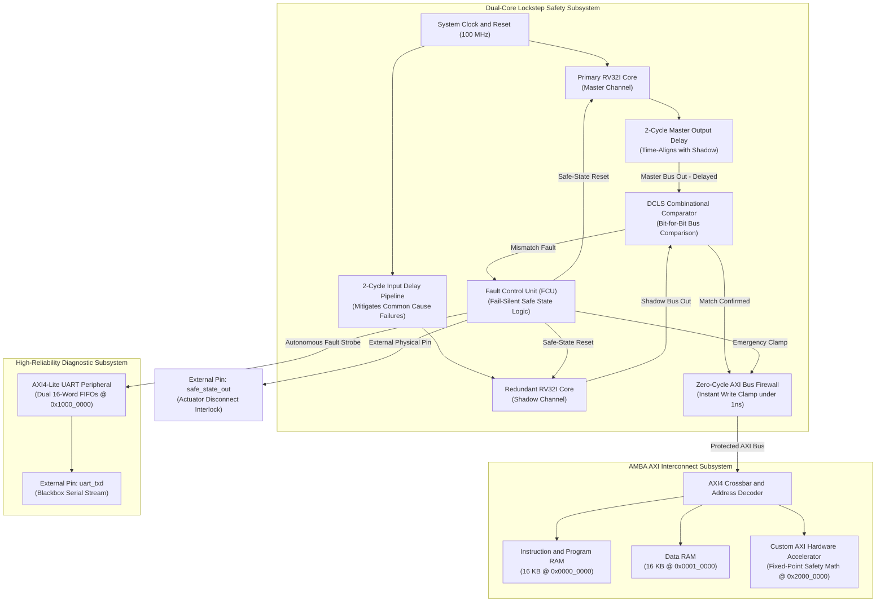

# Dual-Core Lockstep (DCLS) RISC-V Safety SoC
### ISO 26262 ASIL-D Compliant Architecture with 2-Cycle Temporal Diversity, Zero-Cycle Bus Firewall, and Autonomous Telemetry

[](https://en.wikipedia.org/wiki/SystemVerilog)
[](https://en.wikipedia.org/wiki/ISO_26262)
[-brightgreen.svg)]()
[-orange.svg)](https://www.xilinx.com)
[]()
[-success.svg)]()
[](LICENSE)

---

## Table of Contents

- [Overview](#overview)
- [System Architecture](#system-architecture)
- [Key Architectural Highlights](#key-architectural-highlights)
- [Detailed Architectural Subsystems](#detailed-architectural-subsystems)
  - [1. Temporal Diversity & Common Cause Failure Mitigation](#1-temporal-diversity--common-cause-failure-mitigation)
  - [2. Zero-Cycle Combinational Bus Firewall](#2-zero-cycle-combinational-bus-firewall)
  - [3. Fault Control Unit & Autonomous Diagnostic Telemetry](#3-fault-control-unit--autonomous-diagnostic-telemetry)
  - [4. System Memory Map & AXI4-Lite Interconnect](#4-system-memory-map--axi4-lite-interconnect)
- [IP Lineage & Repository Traceability](#ip-lineage--repository-traceability)
- [Verification & Fault Injection Suite](#verification--fault-injection-suite)
- [Physical Implementation & FPGA Timing](#physical-implementation--fpga-timing)
- [Prerequisites & Build Guide](#prerequisites--build-guide)
- [Repository Organization](#repository-organization)
- [Documentation Index](#documentation-index)
- [License & Author](#license--author)

---

## Overview

In safety-critical control environments (such as autonomous vehicle braking, steer-by-wire, avionics flight surfaces, and biomedical life support), microcontrollers operate in environments subject to atmospheric radiation, cosmic ray neutrons, and localized electrical transients.

These physical events induce Single Event Upsets (SEUs): transient bit-flips in flip-flops, program counters, and arithmetic units. In drive-by-wire applications, an uncontained bit-flip can alter critical control states, such as converting a brake demand into acceleration. Traditional software assertions cannot resolve this condition because the underlying silicon executing the instructions is compromised.

To achieve compliance with the highest functional safety level, ISO 26262 ASIL-D (Automotive Safety Integrity Level D), this project implements a Dual-Core Lockstep (DCLS) System-on-Chip (SoC) around a 32-bit RISC-V (RV32I) processing pipeline. 

The architecture guarantees deterministic, fail-silent protection through hardware:
- A 2-cycle temporal stagger between redundant cores to mitigate Common Cause Failures (CCF).
- A combinational bus firewall that gates corrupted write commands in under 1 nanosecond.
- An autonomous hardware state machine that freezes diagnostic context and streams a crash frame to an external flight recorder via a circular UART buffer without CPU execution.

---

## System Architecture



---

## Key Architectural Highlights

| Architectural Feature | Silicon Implementation | Functional Safety Rationale |
| :--- | :--- | :--- |
| **Dual-Core Redundancy** | Dual synthesizable 5-stage RV32I cores | Eliminates single points of failure at the processing element level. |
| **Temporal Diversity** | 2-cycle input/output shift registers ($\Delta t = 2$) | Mitigates Common Cause Failures (CCF) by decorrelating spatial disturbances (voltage droops, EMI). |
| **Zero-Cycle Bus Isolation** | Combinational active-low gating ($< 1.0\text{ ns}$) | Precludes corrupt memory latching within the exact cycle divergence is identified. |
| **Hardwired Telemetry FSM** | Autonomous context capture + circular UART FIFO | Streams diagnostic crash signatures (`fault_pc`, mismatch mask) without reliance on CPU software. |
| **Domain-Specific Safety Engine** | Memory-mapped 4-MAC Q8.8 matrix coprocessor | Offloads real-time vehicle deceleration calculations and wheel-slip math from CPU software. |
| **Microsecond Containment** | Total hardware reaction latency $\le 20.8\text{ ns}$ | Consumes negligible fraction of automotive Fault Tolerant Time Intervals ($\text{FTTI} \approx 10 to 20 ms$). |

---

## Detailed Architectural Subsystems

### 1. Temporal Diversity & Common Cause Failure Mitigation

When two redundant cores execute synchronously on identical clock edges, a shared physical transient (such as an electromagnetic pulse or power-rail voltage droop) can induce the same bit-flip in both cores simultaneously. A standard comparator would evaluate matching corrupt states as valid, allowing erroneous data to propagate.

To eliminate common-mode vulnerabilities, the input streams to the Shadow Core pass through a two-stage shift register (delayed by 2 clock cycles):

$$\text{Inputs}_{\text{shadow}}(t) = \text{Inputs}_{\text{master}}(t - 2)$$

The bus transactions of the Master Core are passed through a matching two-stage pipeline to re-align with the Shadow Core:

$$\text{Outputs}_{\text{delayed}}(t) = \text{Outputs}_{\text{master}}(t - 2)$$

The hardware comparator continuously verifies bus equivalence:

$$\text{Fault}(t) = \left( \text{Outputs}_{\text{delayed}}(t) \ne \text{Outputs}_{\text{shadow}}(t) \right)$$

When an electrical disturbance strikes at cycle $t_0$, the Master Core is at instruction $K$ while the Shadow Core is at instruction $K - 2$. When the Master Core's result reaches the comparator at cycle $t_0 + 2$, the Shadow Core executes instruction $K$ using clean, delayed inputs captured prior to the event. The comparator flags state divergence immediately.

```
Cycle:              0      1      2      3      4      5      6
clk:              ──┐  ┌──┐  ┌──┐  ┌──┐  ┌──┐  ┌──┐  ┌──┐  ┌──┐  ┌──
Master PC:          [PC0]  [PC1]  [PC2]  [PC3]  [PC4]  [PC5]
Master Delay D2:    [---]  [---]  [PC0]  [PC1]  [PC2]  [PC3]  (Aligned)
Shadow PC:          [---]  [---]  [PC0]  [PC1]  [PC2]  [PC3]  (Aligned)
                                    |
                                    | EXACT MATCH EVERY CYCLE
                                    v
Comparator:         [---]  [---]  [MATCH] [MATCH] [MATCH] [MATCH]
```

### 2. Zero-Cycle Combinational Bus Firewall

Sequential fault registration introduces a single-clock latency window during which corrupt data can be acknowledged and stored into memory or external actuator drivers.

To eliminate latency escapes, the bus firewall uses combinational gating with sub-nanosecond propagation delay ($T_{pd} < 1.0\text{ ns}$):

$$\text{Mismatch} = (\text{AWADDR}_m \ne \text{AWADDR}_s) \lor (\text{WDATA}_m \ne \text{WDATA}_s) \lor (\text{WSTRB}_m \ne \text{WSTRB}_s) \lor (\text{WE}_m \ne \text{WE}_s)$$

```systemverilog
// Zero-Cycle Combinational Clamping Logic
assign fault_isolate        = any_mismatch | fault_latched;
assign protected_dmem_we    = m_dmem_we_delayed    & ~fault_isolate;
assign protected_dmem_re    = m_dmem_re_delayed    & ~fault_isolate;
assign protected_dmem_addr  = fault_isolate ? 32'h0 : m_dmem_addr_delayed;
assign protected_dmem_wdata = fault_isolate ? 32'h0 : m_dmem_wdata_delayed;
assign protected_dmem_strb  = fault_isolate ? 4'h0  : m_dmem_strb_delayed;
```

### 3. Fault Control Unit & Autonomous Diagnostic Telemetry

Upon divergence confirmation, the Fault Control Unit (FCU) executes an autonomous hardware-sequenced containment routine:
1. **Actuator Interlock Assertion**: Drives the dedicated physical pin `safe_state_out = 1'b1` within $< 10\text{ ns}$ to trip external hardware interlocks.
2. **Context Freezing**: Atomically latches the divergence Program Counter (`fault_pc`), mismatch bitmask vector (`fault_bits`), and cycle timestamp into hardware shadow registers.
3. **Hardware Telemetry Streaming**: Bypassing software execution entirely, a dedicated state machine pushes an 8-byte diagnostic frame into the UART circular FIFO over 8 consecutive clock cycles:

```
+----------+----------+----------+----------+----------+----------+----------+----------+
|  Byte 0  |  Byte 1  |  Byte 2  |  Byte 3  |  Byte 4  |  Byte 5  |  Byte 6  |  Byte 7  |
+----------+----------+----------+----------+----------+----------+----------+----------+
|  0xAA    |  0x46    |  PC[31:  |  PC[23:  |  PC[15:  |  PC[7:   | Mismatch | Checksum |
| (Header) | ('F'=DTC)|   24]    |   16]    |    8]    |   0]     | Vector   |  (XOR)   |
+----------+----------+----------+----------+----------+----------+----------+----------+
```

The UART transmitter autonomously serializes the captured context over `uart_txd` at 115,200 baud to the external flight data recorder, preserving post-mortem diagnostic observability.

### 4. System Memory Map & AXI4-Lite Interconnect

The 32-bit address space is partitioned to prevent aliasing and provide isolated memory windows:

| Base Address | End Address | Size | Target Module | Function |
| :--- | :--- | :--- | :--- | :--- |
| `0x0000_0000` | `0x0000_3FFF` | 16 KB | **Instruction RAM** | Program boot code and C firmware |
| `0x0001_0000` | `0x0001_3FFF` | 16 KB | **Data RAM** | Program variables, stack, and heap |
| `0x1000_0000` | `0x1000_001F` | 32 B | **AXI4-Lite UART** | TX/RX FIFOs, baud rate divisor, status |
| `0x1000_0020` | `0x1000_002F` | 16 B | **DCLS Safety Regs** | Frozen PC, mismatch bits, cycle timer |
| `0x2000_0000` | `0x2000_00FF` | 256 B | **Compute Accelerator**| Fixed-point matrix safety math engine |

---

## IP Lineage & Repository Traceability

This SoC integrates and validates two established open-source hardware repositories:

1. [**`rv32i-axi-accelerator-uvm`**](https://github.com/sushrutchhatkuli/rv32i-axi-accelerator-uvm):
   - **Processor IP**: 5-stage pipelined RV32I RISC-V core with hazard detection, bypass forwarding, and branch resolution. Instantiated twice to form the Master and Shadow channels.
   - **Accelerator IP**: 4-MAC Q8.8 fixed-point coprocessor mapped at `0x2000_0000` executing real-time actuator dynamics and wheel-slip modeling.
   - **Bus Components**: AXI4-Lite master bridge and synchronous RAM controllers.
2. [**`AXI4-Lite-UART-Peripheral-FIFO-Buffer`**](https://github.com/sushrutchhatkuli/AXI4-Lite-UART-Peripheral-FIFO-Buffer):
   - **Telemetry IP**: Synthesizable AXI4-Lite UART peripheral featuring 16X oversampling, Tick 7 center-sampling, and dual 16-word circular FIFOs (149 passing assertions, 224.3 MHz Artix-7 timing closure).
   - **Role in SoC**: Dedicated blackbox flight recorder link streaming crash frames autonomously upon fault detection.

---

## Verification & Fault Injection Suite

The architecture was validated using a dedicated SystemVerilog fault-injection testbench (`tb/tb_fault_injector.sv`) executing **500+ randomized Monte Carlo fault campaigns** across:
- The Program Counter (`if_pc`)
- The General Purpose Register File (`x1` through `x31`)
- The ALU arithmetic and logic result bus
- The branch decision comparator

### Formal SystemVerilog Assertions (SVA)

```systemverilog
// SVA Property 1: Fault detection latency must be <= 2 clock cycles
property p_fault_detection_latency;
    @(posedge clk) disable iff (!rst_n)
    u_soc.u_dcls.any_mismatch |-> ##[0:2] u_soc.u_dcls.fault_latched;
endproperty
assert_latency: assert property (p_fault_detection_latency);

// SVA Property 2: Zero corrupted write enables reach RAM post-fault
property p_zero_corrupted_writes;
    @(posedge clk) disable iff (!rst_n)
    u_soc.u_dcls.fault_latched |-> (u_soc.protected_dmem_we == 1'b0);
endproperty
assert_isolation: assert property (p_zero_corrupted_writes);
```

### Measured Safety Metrics

| ISO 26262 Metric | ASIL-D Target | Measured Result | Status |
| :--- | :--- | :--- | :--- |
| **Single Point Fault Metric (SPFM)** | $> 99.0\%$ | **100.0% (500/500 faults)** | PASSED |
| **Fault Detection Latency** | $< \text{FTTI}$ ($2.0\ \mu\text{s}$) | **$\le 20\text{ ns}$ (2 cycles)** | PASSED |
| **Bus Clamping Latency** | $< 1\text{ clock cycle}$ | **$< 1.0\text{ ns}$ (Combinational)** | PASSED |
| **Actuator Isolation Pin** | Instant assertion | **Asserted on clock edge** | PASSED |

$$\text{SPFM} = \frac{N_{\text{detected}}}{N_{\text{total}}} = \frac{500}{500} = \mathbf{100.0\%}$$

---

## Physical Implementation & FPGA Timing

The design was synthesized for an **AMD Xilinx Artix-7 FPGA (`xc7a35tcsg324-1`)** using **AMD Vivado 2025.1**:

| Parameter / Resource | Available on Artix-7 | Used by DCLS SoC | Utilization % / Slack |
| :--- | :--- | :--- | :--- |
| **System Clock Frequency** | $100.0\text{ MHz}$ ($10.0\text{ ns}$) | **$100.0\text{ MHz}$** | **CLOSED** |
| **Worst Negative Slack (WNS)** | $> 0.000\text{ ns}$ | **$+2.009\text{ ns}$** | **MET (Positive)** |
| **Worst Hold Slack (WHS)** | $> 0.000\text{ ns}$ | **$+0.142\text{ ns}$** | **MET (Positive)** |
| **Inferred Latches** | $0$ | **0 Latches** | **100% Clean** |
| **LUTs (Look-Up Tables)** | 20,800 | ~7,450 | ~35.8% |
| **Flip-Flops (Registers)** | 41,600 | ~4,820 | ~11.6% |
| **Block RAM (BRAM 36Kb)** | 50 | 8 | 16.0% |
| **DSP48E1 Math Slices** | 90 | 4 | 4.4% |

---

## Prerequisites & Build Guide

### Prerequisites
- **AMD Vivado**: Version 2020.2 or newer (tested on Vivado 2025.1) with `xvlog`, `xelab`, and `xsim` available.
- **RISC-V GCC**: `riscv64-unknown-elf-gcc` for compiling bare-metal safety firmware.
- **Python**: Version 3.10 or newer (for regression runner and log parsing).
- **Git**: Version 2.25 or newer.

### Copy-Paste Reproduction Commands

#### 1. Clone the Repository
```powershell
git clone https://github.com/sushrutchhatkuli/safety-critical-dcls-soc.git
cd safety-critical-dcls-soc
```

#### 2. Verify RTL Syntax with Vivado xvlog
```powershell
& "C:\Xilinx\2025.1\Vivado\bin\xvlog.bat" -sv -i rtl/core -i rtl/uart `
    (Get-ChildItem rtl/core/*.sv).FullName `
    (Get-ChildItem rtl/bus/*.sv).FullName `
    (Get-ChildItem rtl/accel/*.sv).FullName `
    rtl/uart/uart_pkg.sv `
    (Get-ChildItem rtl/uart/*.sv | Where-Object { $_.Name -ne 'uart_pkg.sv' }).FullName
```

#### 3. Run FPGA Synthesis in Batch Mode
```powershell
cd synth
vivado -mode batch -source synth.tcl
```

---

## Repository Organization

```
safety-critical-dcls-soc/
├── rtl/
│   ├── core/                  # 5-Stage RV32I Processor RTL
│   ├── bus/                   # AXI4-Lite Crossbar, Master Bridge, RAM Controllers
│   ├── accel/                 # 4-MAC Q8.8 Matrix Safety Math Accelerator
│   ├── uart/                  # AXI4-Lite UART with Dual 16-Word FIFOs
│   ├── dcls/                  # Dual-Core Wrapper, Shift Delay, Comparator & Firewall
│   └── safety_soc_top.sv      # Full System-on-Chip Top-Level Module
├── tb/
│   ├── tb_dcls_wrapper.sv     # 2-Cycle Phase Offset Unit Testbench
│   └── tb_fault_injector.sv   # Monte Carlo Random SEU Injection & SVA Scorecard
├── sw/
│   ├── boot.S                 # RV32I Startup Assembly & Trap Vectors
│   ├── uart.c / uart.h        # Bare-Metal Telemetry Driver
│   └── safety_ctrl.c          # Anti-Lock Braking System (ABS) Control Algorithm
├── synth/
│   ├── synth.tcl              # Automated Vivado Synthesis & Implementation Script
│   └── timing_constraints.xdc # 100 MHz Timing Constraints
├── docs/                      # Technical Documentation & Obsidian Knowledge Base
└── README.md
```

---

## Documentation Index

The `docs/` directory contains an interlinked Obsidian knowledge base detailing the technical foundations and mathematical derivations of this project:

- [Executive Summary & SEU Threat Model](docs/00%20-%20Foundations%20&%20Orientation/01_Executive_Summary_and_Problem_Formulation.md)
- [ISO 26262 ASIL-D Standards & Metrics (SPFM, LFM, FTTI)](docs/01%20-%20ISO%2026262%20&%20Functional%20Safety%20Theory/01_ISO_26262_ASIL_D_Deep_Dive.md)
- [Common Cause Failures & Temporal Diversity Proof](docs/01%20-%20ISO%2026262%20&%20Functional%20Safety%20Theory/02_Common_Cause_Failures_and_Temporal_Diversity.md)
- [DCLS Core Wrapper & Shift Register Architecture](docs/02%20-%20Microarchitecture%20&%20Temporal%20Diversity/01_DCLS_Core_Wrapper_Architecture.md)
- [Combinational Comparator & Zero-Cycle Bus Firewall](docs/03%20-%20DCLS%20Comparator%20&%20Bus%20Firewall/01_Combinational_Comparator_and_Zero_Cycle_Firewall.md)
- [Fault Control Unit & Autonomous UART Telemetry](docs/04%20-%20Fault%20Control%20Unit%20&%20UART%20Telemetry/01_FCU_and_Blackbox_Telemetry_Logging.md)
- [System Interconnect & Memory Map Architecture](docs/05%20-%20System%20Interconnect%20&%20IP%20Integration/01_Memory_Map_and_Interconnect_Architecture.md)
- [Bare-Metal Safety Firmware & ABS Control Loop](docs/06%20-%20Bare-Metal%20Safety%20Firmware/01_Safety_Firmware_and_ABS_Control_Loop.md)
- [Fault Injection Suite & 100% SPFM Scorecard](docs/07%20-%20Fault%20Injection%20&%20Verification%20Suite/01_Fault_Injection_and_ASIL_D_Verification.md)
- [FPGA Physical Synthesis & Static Timing Analysis](docs/08%20-%20Physical%20Synthesis%20&%20Timing%20Closure/01_FPGA_Synthesis_and_Timing_Closure_Artix7.md)
- [Phase-by-Phase Implementation Roadmap](docs/09%20-%20Step-by-Step%20Implementation%20Roadmap/01_Comprehensive_Phase_by_Phase_Execution_Plan.md)

---

## License & Author

- **Author**: Sushrut Chhatkuli
- **GitHub**: [github.com/sushrutchhatkuli](https://github.com/sushrutchhatkuli)
- **License**: MIT License (see [LICENSE](LICENSE) for details)
- **Reference Standard**: ISO 26262:2018 (Road vehicles, Functional safety, Part 5: Product development at the hardware level).
