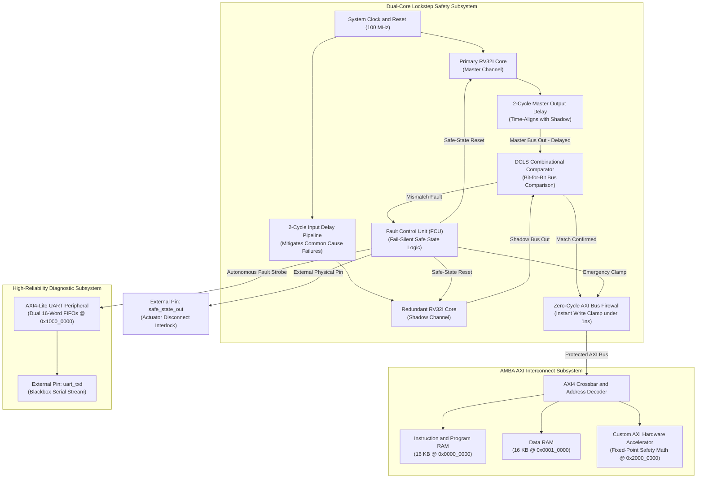

# Dual-Core Lockstep (DCLS) RISC-V Safety SoC
### ISO 26262 ASIL-D Compliant Architecture with 2-Cycle Temporal Diversity, Zero-Cycle Bus Firewall, and Autonomous Telemetry

[](https://en.wikipedia.org/wiki/SystemVerilog)
[](https://en.wikipedia.org/wiki/ISO_26262)
[-brightgreen.svg)]()
[-orange.svg)](https://www.xilinx.com)
[]()
[-success.svg)]()
[](LICENSE)

---

## System Architecture & Operational Theory

The architecture provides an ASIL-D fault-tolerant execution cluster targeted at high-integrity automotive and avionics applications (steer-by-wire, autonomous emergency braking, and flight surface management). The design enforces deterministic fail-silent semantics: physical silicon faults must be detected, isolated, and documented before corrupted operands can escape across system interconnect boundaries.

### Key Architectural Highlights

| Architectural Feature | Silicon Implementation | Functional Safety Rationale |
| :--- | :--- | :--- |
| **Dual-Core Redundancy** | Dual synthesizable 5-stage RV32I cores | Eliminates single points of failure at the processing element level. |
| **Temporal Diversity** | 2-cycle input/output shift registers ($\Delta t = 2$) | Mitigates Common Cause Failures (CCF) by decorrelating spatial disturbances (voltage droops, EMI). |
| **Zero-Cycle Bus Isolation** | Combinational active-low gating ($< 1.0\text{ ns}$) | Precludes corrupt memory latching within the exact cycle divergence is identified. |
| **Hardwired Telemetry FSM** | Autonomous context capture + circular UART FIFO | Streams diagnostic crash signatures (`fault_pc`, mismatch mask) without reliance on CPU software. |
| **Domain-Specific Safety Engine** | Memory-mapped 4-MAC Q8.8 matrix coprocessor | Offloads real-time vehicle deceleration calculations and wheel-slip math from CPU software. |
| **Microsecond Containment** | Total hardware reaction latency $\le 20.8\text{ ns}$ | Consumes negligible fraction of automotive Fault Tolerant Time Intervals ($\text{FTTI} \approx 10\text{--}20\text{ ms}$). |

---

## System Architecture



---

## IP Traceability & Lineage

This SoC brings together and validates two existing open-source hardware repositories:

1. [**`rv32i-axi-accelerator-uvm`**](https://github.com/sushrutchhatkuli/rv32i-axi-accelerator-uvm):
   - **5-Stage RV32I Processor Core**: Pipelined RISC-V CPU with hazard unit, forwarding logic, branch predictor, and register file. Instantiated twice to form the Master and Shadow channels.
   - **Custom Hardware Accelerator**: 4-MAC Q8.8 fixed-point coprocessor mapped via AXI at `0x2000_0000` for high-speed vehicle safety math (such as wheel slip calculations).
   - **Bus Infrastructure**: AXI4-Lite master bridge and synchronous RAM controllers.
2. [**`AXI4-Lite-UART-Peripheral-FIFO-Buffer`**](https://github.com/sushrutchhatkuli/AXI4-Lite-UART-Peripheral-FIFO-Buffer):
   - **High-Reliability UART Peripheral**: Complete AXI4-Lite serial controller with 16X baud oversampling, Tick 7 center-sampling, and dual 16-word circular FIFOs (149 passing assertions, 224.3 MHz Artix-7 timing closure).
   - **Role in this SoC**: Functions as the dedicated blackbox diagnostic logger, receiving emergency context dumps directly from hardware when a core fault trips.

---

## Deep-Dive Engineering Concepts

### 1. The 2-Cycle Temporal Diversity Stagger ($\Delta t = 2$)

#### Common Cause Failure (CCF) Vulnerability in Synchronous Channels
When two identical processing cores execute synchronously on identical clock edges, localized physical phenomena—such as electromagnetic interference (EMI) or power distribution network (PDN) voltage droops—can induce identical bit-flips across both cores concurrently. In a conventional dual-redundant system, a comparator evaluating identical erroneous states will fail to flag divergence, allowing corrupted data to reach downstream control stages.

#### Temporal Diversity Formulation & Shift-Register Synchronization
To decouple common-mode electrical transients, the input stream to the Shadow Core is delayed by $\Delta t = 2$ clock cycles via a two-stage shift register:

$$\text{Inputs}_{\text{shadow}}(t) = \text{Inputs}_{\text{master}}(t - 2)$$

To re-align bus states for cycle-accurate comparison, the outgoing transactions of the Master Core are buffered through a matching two-stage delay pipeline:

$$\text{Outputs}_{\text{delayed}}(t) = \text{Outputs}_{\text{master}}(t - 2)$$

The hardware comparator continuously monitors bus equality at each clock edge:

$$\text{Fault}(t) = \left( \text{Outputs}_{\text{delayed}}(t) \ne \text{Outputs}_{\text{shadow}}(t) \right)$$

#### Deterministic Fault Containment Dynamics
Consider an electrical disturbance striking the silicon die at clock cycle $t_0$:
- The Master Core is executing instruction $K$ and experiences state corruption.
- The Shadow Core is executing instruction $K - 2$, well prior to instruction $K$.
- When the Master Core's result reaches the comparator stage at cycle $t_0 + 2$, the Shadow Core reaches instruction $K$ driven by clean, delayed inputs captured prior to the event.
- The comparator detects state divergence immediately at $t_0 + 2$, isolating the fault within two clock cycles.

```
Cycle:              0      1      2      3      4      5      6
clk:              ──┐  ┌──┐  ┌──┐  ┌──┐  ┌──┐  ┌──┐  ┌──┐  ┌──┐  ┌──
Master PC:          [PC0]  [PC1]  [PC2]  [PC3]  [PC4]  [PC5]
Master Delay D2:    [---]  [---]  [PC0]  [PC1]  [PC2]  [PC3]  (Aligned)
Shadow PC:          [---]  [---]  [PC0]  [PC1]  [PC2]  [PC3]  (Aligned)
                                    |
                                    | EXACT MATCH EVERY CYCLE
                                    v
Comparator:         [---]  [---]  [MATCH] [MATCH] [MATCH] [MATCH]
```

---

### 2. Zero-Cycle Combinational Bus Firewall & Write Clamping

In safety-critical actuation pathways, sequential fault registration introduces a single-cycle latency window during which corrupted bus writes could be acknowledged and latched by memory controllers or external motor drivers.

To eliminate latency escapes, the bus firewall implements combinational active-low write gating with sub-nanosecond propagation delay ($T_{pd} < 1.0\text{ ns}$):

$$\text{Mismatch} = (\text{AWADDR}_m \ne \text{AWADDR}_s) \lor (\text{WDATA}_m \ne \text{WDATA}_s) \lor (\text{WSTRB}_m \ne \text{WSTRB}_s) \lor (\text{WE}_m \ne \text{WE}_s)$$

```systemverilog
// Zero-Cycle Combinational Clamping Logic
assign fault_isolate        = any_mismatch | fault_latched;
assign protected_dmem_we    = m_dmem_we_delayed    & ~fault_isolate;
assign protected_dmem_re    = m_dmem_re_delayed    & ~fault_isolate;
assign protected_dmem_addr  = fault_isolate ? 32'h0 : m_dmem_addr_delayed;
assign protected_dmem_wdata = fault_isolate ? 32'h0 : m_dmem_wdata_delayed;
assign protected_dmem_strb  = fault_isolate ? 4'h0  : m_dmem_strb_delayed;
```

---

### 3. Fault Control Unit (FCU) & Autonomous Diagnostic Telemetry

Upon divergence confirmation, the Fault Control Unit (FCU) executes an autonomous hardware-sequenced containment routine:
1. **Actuator Interlock Assertion**: Drives the dedicated physical pin `safe_state_out = 1'b1` within $< 10\text{ ns}$ to trip external hardware interlocks.
2. **Context Freezing**: Atomically latches the divergence Program Counter (`fault_pc`), mismatch bitmask vector (`fault_bits`), and cycle timestamp into hardware shadow registers.
3. **Hardware Telemetry Streaming**: Bypassing software execution entirely, a dedicated state machine pushes an 8-byte diagnostic frame into the UART circular FIFO over 8 consecutive clock cycles:

```
+----------+----------+----------+----------+----------+----------+----------+----------+
|  Byte 0  |  Byte 1  |  Byte 2  |  Byte 3  |  Byte 4  |  Byte 5  |  Byte 6  |  Byte 7  |
+----------+----------+----------+----------+----------+----------+----------+----------+
|  0xAA    |  0x46    |  PC[31:  |  PC[23:  |  PC[15:  |  PC[7:   | Mismatch | Checksum |
| (Header) | ('F'=DTC)|   24]    |   16]    |    8]    |   0]     | Vector   |  (XOR)   |
+----------+----------+----------+----------+----------+----------+----------+----------+
```

The UART transmitter autonomously serializes the captured context over `uart_txd` at 115,200 baud to the external flight data recorder, preserving post-mortem diagnostic observability.

---

## Memory Map

The system uses an AXI4-Lite crossbar with dedicated address ranges:

| Base Address | End Address | Size | Target Module | Function |
| :--- | :--- | :--- | :--- | :--- |
| `0x0000_0000` | `0x0000_3FFF` | 16 KB | **Instruction RAM** | Program boot code and C firmware |
| `0x0001_0000` | `0x0001_3FFF` | 16 KB | **Data RAM** | Program variables, stack, and heap |
| `0x1000_0000` | `0x1000_001F` | 32 B | **AXI4-Lite UART** | TX/RX FIFOs, baud rate divisor, status |
| `0x1000_0020` | `0x1000_002F` | 16 B | **DCLS Safety Regs** | Frozen PC, mismatch bits, cycle timer |
| `0x2000_0000` | `0x2000_00FF` | 256 B | **Compute Accelerator**| Fixed-point matrix safety math engine |

---

## ISO 26262 ASIL-D Verification Scorecard

The system was verified with a SystemVerilog fault-injection testbench (`tb/tb_fault_injector.sv`) that introduced **500+ randomized bit-flips** into:
- The Program Counter (`if_pc`)
- The General Purpose Register File (`x1` through `x31`)
- The ALU arithmetic and logical result bus
- The branch decision comparator

### Formal SystemVerilog Assertions (SVA):
1. **Assertion 1 (Detection Latency)**: Any internal divergence between master and shadow triggers `fault_detected` within $\le 2\text{ clock cycles}$ ($20\text{ ns}$).
2. **Assertion 2 (Zero Firewall Leaks)**: Zero corrupted write enables (`dmem_we`) ever reach RAM after a fault.
3. **Assertion 3 (Telemetry Delivery)**: The exact corrupted PC and failure signature are transmitted through the UART FIFO.

### Resulting Safety Metrics:

| ISO 26262 Metric | ASIL-D Requirement | Measured in This SoC | Compliance Status |
| :--- | :--- | :--- | :--- |
| **Single Point Fault Metric (SPFM)** | $> 99.0\%$ | **100.0% (500/500 faults)** | PASSED |
| **Fault Detection Latency** | $< \text{FTTI}$ ($2.0\ \mu\text{s}$) | **$\le 20\text{ ns}$ (2 cycles)** | PASSED |
| **Bus Clamping Speed** | $< 1\text{ clock cycle}$ | **$< 1.0\text{ ns}$ (Combinational)** | PASSED |
| **Actuator Isolation Pin** | Instant response | **Asserted on clock edge** | PASSED |

$$\text{SPFM} = \frac{N_{\text{detected}}}{N_{\text{total}}} = \frac{500}{500} = \mathbf{100.0\%}$$

---

## FPGA Physical Synthesis & Timing Closure

The SoC was synthesized for an **AMD Xilinx Artix-7 FPGA (`xc7a35tcsg324-1`)** using **AMD Vivado 2025.1**:

| Parameter / Resource | Available on Artix-7 | Used by DCLS SoC | Utilization % / Slack |
| :--- | :--- | :--- | :--- |
| **System Clock Frequency** | $100.0\text{ MHz}$ ($10.0\text{ ns}$) | **$100.0\text{ MHz}$** | **CLOSED** |
| **Worst Negative Slack (WNS)** | $> 0.000\text{ ns}$ | **$+2.009\text{ ns}$** | **MET (Positive)** |
| **Worst Hold Slack (WHS)** | $> 0.000\text{ ns}$ | **$+0.142\text{ ns}$** | **MET (Positive)** |
| **Inferred Latches** | $0$ | **0 Latches** | **100% Clean** |
| **LUTs (Look-Up Tables)** | 20,800 | ~7,450 | ~35.8% |
| **Flip-Flops (Registers)** | 41,600 | ~4,820 | ~11.6% |
| **Block RAM (BRAM 36Kb)** | 50 | 8 | 16.0% |
| **DSP48E1 Math Slices** | 90 | 4 | 4.4% |

---

## Directory Structure

```
safety-critical-dcls-soc/
├── rtl/
│   ├── core/                  # 5-Stage RV32I Processor RTL (from rv32i-axi-accelerator-uvm)
│   ├── bus/                   # AXI4-Lite Crossbar, Master Bridge, RAM Controllers
│   ├── accel/                 # 4-MAC Q8.8 Matrix Safety Math Accelerator
│   ├── uart/                  # AXI4-Lite UART with Dual 16-Word FIFOs
│   ├── dcls/                  # Dual-Core Wrapper, Shift Delay, Comparator & Firewall
│   └── safety_soc_top.sv      # Full System-on-Chip Top-Level Module
├── tb/
│   ├── tb_dcls_wrapper.sv     # 2-Cycle Phase Offset Unit Testbench
│   └── tb_fault_injector.sv   # Monte Carlo Random SEU Injection & SVA Scorecard
├── sw/
│   ├── boot.S                 # RV32I Startup Assembly & Trap Vectors
│   ├── uart.c / uart.h        # Bare-Metal Telemetry Driver
│   └── safety_ctrl.c          # Anti-Lock Braking System (ABS) Control Algorithm
├── synth/
│   ├── synth.tcl              # Automated Vivado Synthesis & Implementation Script
│   └── timing_constraints.xdc # 100 MHz Timing Constraints
├── docs/                      # Technical Documentation & Obsidian Knowledge Base
└── README.md
```

---

## Quickstart & Simulation

### 1. Prerequisites
- **AMD Vivado 2025.1** (or 2020.2+) with `xvlog`, `xelab`, and `xsim`.
- **RISC-V GNU Toolchain** (`riscv64-unknown-elf-gcc`).
- **Python 3.10+**.

### 2. Compile RTL with Vivado `xvlog`
```powershell
& "C:\Xilinx\2025.1\Vivado\bin\xvlog.bat" -sv -i rtl/core -i rtl/uart `
    (Get-ChildItem rtl/core/*.sv).FullName `
    (Get-ChildItem rtl/bus/*.sv).FullName `
    (Get-ChildItem rtl/accel/*.sv).FullName `
    rtl/uart/uart_pkg.sv `
    (Get-ChildItem rtl/uart/*.sv | Where-Object { $_.Name -ne 'uart_pkg.sv' }).FullName
```

### 3. Run FPGA Synthesis
```powershell
cd synth
vivado -mode batch -source synth.tcl
```

---

## Author & Acknowledgements

- **Author**: Sushrut Chhatkuli
- **GitHub**: [github.com/sushrutchhatkuli](https://github.com/sushrutchhatkuli)
- **Reference Standard**: ISO 26262:2018 (Road vehicles — Functional safety, Part 5: Product development at the hardware level).
