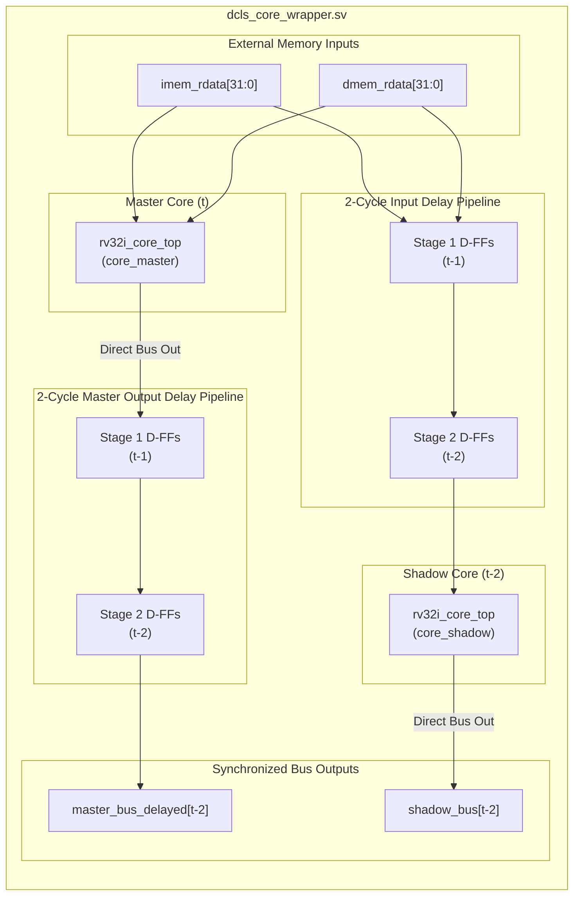

# 🏗️ Microarchitecture: DCLS Core Wrapper & Temporal Diversity Pipeline

> [!NOTE] **RTL Target Module**
> Implemented in `rtl/dcls/dcls_core_wrapper.sv`. Encloses two complete 5-stage pipelined RV32I cores (`core_master` and `core_shadow`) with hardware temporal diversity shift registers.

---

## 1. Top-Level Wrapper Block Diagram



---

## 2. Bus Delay Signal Matrix

To guarantee strict cycle-by-cycle equivalence at time $t - 2$, both the instruction bus and the data memory bus signals are aligned:

### 2.1 Inputs to Shadow Core (Delayed by 2 Cycles)
```systemverilog
// 2-Stage Input Delay Pipeline
logic [31:0] imem_rdata_d1, imem_rdata_d2;
logic [31:0] dmem_rdata_d1, dmem_rdata_d2;

always_ff @(posedge clk or negedge rst_n) begin
    if (!rst_n) begin
        imem_rdata_d1 <= 32'h0000_0013; // NOP (addi x0, x0, 0)
        imem_rdata_d2 <= 32'h0000_0013;
        dmem_rdata_d1 <= 32'h0000_0000;
        dmem_rdata_d2 <= 32'h0000_0000;
    end else begin
        imem_rdata_d1 <= imem_rdata;
        imem_rdata_d2 <= imem_rdata_d1;
        dmem_rdata_d1 <= dmem_rdata;
        dmem_rdata_d2 <= dmem_rdata_d1;
    end
end
```

### 2.2 Outputs from Master Core (Delayed by 2 Cycles)
```systemverilog
// 2-Stage Master Output Delay Pipeline
logic [31:0] m_imem_addr_d1,  m_imem_addr_d2;
logic [31:0] m_dmem_addr_d1,  m_dmem_addr_d2;
logic [31:0] m_dmem_wdata_d1, m_dmem_wdata_d2;
logic [3:0]  m_dmem_strb_d1,  m_dmem_strb_d2;
logic        m_dmem_we_d1,    m_dmem_we_d2;
logic        m_dmem_re_d1,    m_dmem_re_d2;

always_ff @(posedge clk or negedge rst_n) begin
    if (!rst_n) begin
        m_imem_addr_d1  <= 32'h0;
        m_imem_addr_d2  <= 32'h0;
        m_dmem_addr_d1  <= 32'h0;
        m_dmem_addr_d2  <= 32'h0;
        m_dmem_wdata_d1 <= 32'h0;
        m_dmem_wdata_d2 <= 32'h0;
        m_dmem_strb_d1  <= 4'h0;
        m_dmem_strb_d2  <= 4'h0;
        m_dmem_we_d1    <= 1'b0;
        m_dmem_we_d2    <= 1'b0;
        m_dmem_re_d1    <= 1'b0;
        m_dmem_re_d2    <= 1'b0;
    end else begin
        m_imem_addr_d1  <= master_imem_addr;
        m_imem_addr_d2  <= m_imem_addr_d1;
        m_dmem_addr_d1  <= master_dmem_addr;
        m_dmem_addr_d2  <= m_dmem_addr_d1;
        m_dmem_wdata_d1 <= master_dmem_wdata;
        m_dmem_wdata_d2 <= m_dmem_wdata_d1;
        m_dmem_strb_d1  <= master_dmem_strb;
        m_dmem_strb_d2  <= m_dmem_strb_d1;
        m_dmem_we_d1    <= master_dmem_we;
        m_dmem_we_d2    <= m_dmem_we_d1;
        m_dmem_re_d1    <= master_dmem_re;
        m_dmem_re_d2    <= m_dmem_re_d1;
    end
end
```

---

## 3. Waveform Timing Progression

```
Cycle:              0      1      2      3      4      5      6      7
clk:              ──┐  ┌──┐  ┌──┐  ┌──┐  ┌──┐  ┌──┐  ┌──┐  ┌──┐  ┌──┐  ┌──
                    └──┘  └──┘  └──┘  └──┘  └──┘  └──┘  └──┘  └──┘  └──┘
rst_n:            ────────┴───────────────────────────────────────────────
Master PC:          [PC0]  [PC1]  [PC2]  [PC3]  [PC4]  [PC5]  [PC6]
Master Addr D1:     [---]  [PC0]  [PC1]  [PC2]  [PC3]  [PC4]  [PC5]
Master Addr D2:     [---]  [---]  [PC0]  [PC1]  [PC2]  [PC3]  [PC4]  (Delayed Output)
Shadow PC:          [---]  [---]  [PC0]  [PC1]  [PC2]  [PC3]  [PC4]  (Shadow Output)
                                    ▲
                                    │ EQUAL EVERY CYCLE!
                                    ▼
Comparator Match:   [---]  [---]  [MATCH] [MATCH] [MATCH] [MATCH] [MATCH]
```

At every clock cycle $t \ge 2$:
$$\text{Master Addr D2}(t) == \text{Shadow Addr}(t)$$

If any divergence occurs between the delayed master and the real-time shadow output, the comparator fires within the same clock cycle.

Next: Review the comparator structure and the instant isolation firewall in [[01_Combinational_Comparator_and_Zero_Cycle_Firewall | DCLS Combinational Comparator & Zero-Cycle Bus Firewall]].
