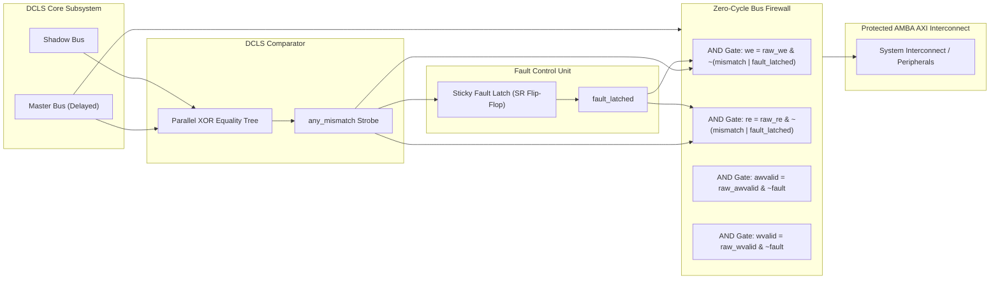

# DCLS Combinational Comparator & Zero-Cycle Bus Firewall

> [!CAUTION] **The Zero-Cycle Requirement**
> If a fault detection circuit takes even 1 clock cycle to register an error before gating the bus, the corrupted data packet has already been acknowledged and latched into external SRAM, Flash, or a CAN/FlexRay motor controller. **The bus firewall must clamp writes combinationally in zero clock cycles ($< 1.0\text{ ns}$ propagation delay)**.

---

## 1. Bit-for-Bit Parallel Comparison Logic

The DCLS Comparator continuously inspects the delayed Master bus against the Shadow core bus on every single clock edge:

```systemverilog
// Mismatch Detection Vector across all critical bus lines
logic addr_mismatch;
logic wdata_mismatch;
logic strb_mismatch;
logic ctrl_mismatch;
logic any_mismatch;

assign addr_mismatch  = (m_dmem_addr_delayed != s_dmem_addr);
assign wdata_mismatch = (m_dmem_wdata_delayed != s_dmem_wdata) && (m_dmem_we_delayed | s_dmem_we);
assign strb_mismatch  = (m_dmem_strb_delayed != s_dmem_strb) && (m_dmem_we_delayed | s_dmem_we);
assign ctrl_mismatch  = (m_dmem_we_delayed != s_dmem_we) || (m_dmem_re_delayed != s_dmem_re);

assign any_mismatch = addr_mismatch | wdata_mismatch | strb_mismatch | ctrl_mismatch;
```

### Truth Table of Bus Evaluation:

| Master Delayed $(t-2)$ | Shadow Output $(t)$ | Mismatch Detected | Firewall Action | FCU Status |
| :---: | :---: | :---: | :---: | :---: |
| `0x0001_0020` | `0x0001_0020` | `0` (Match) | **Pass Through** | `NORMAL` |
| `0x0001_0020` | `0x0001_0024` | `1` (Mismatch) | **COMBINATIONAL CLAMP** | `TRIPPED` |
| `WDATA = 0x00` | `WDATA = 0xFF` | `1` (Mismatch) | **COMBINATIONAL CLAMP** | `TRIPPED` |
| `WE = 1` | `WE = 0` | `1` (Mismatch) | **COMBINATIONAL CLAMP** | `TRIPPED` |

---

## 2. The Zero-Cycle Bus Firewall Circuit

The firewall sits between the DCLS core outputs and the AXI Interconnect Master Bridge:



### SystemVerilog Gate-Level Equation:
```systemverilog
// Combined instantaneous fault: either fresh mismatch right now OR previously latched fault
logic fault_isolate;
assign fault_isolate = any_mismatch | fault_latched;

// Zero-cycle combinational gating
assign protected_dmem_we    = m_dmem_we_delayed    & ~fault_isolate;
assign protected_dmem_re    = m_dmem_re_delayed    & ~fault_isolate;
assign protected_dmem_addr  = fault_isolate ? 32'h0 : m_dmem_addr_delayed;
assign protected_dmem_wdata = fault_isolate ? 32'h0 : m_dmem_wdata_delayed;
assign protected_dmem_strb  = fault_isolate ? 4'h0  : m_dmem_strb_delayed;
```

---

## 3. Propagation Delay & Synthesis Timing Closure

In standard cell ASIC (TSMC 28nm) or AMD Artix-7 FPGA:
- 32-bit XOR tree depth: $\log_2(32) \approx 5$ LUT levels or gate stages.
- Total propagation delay $T_{pd} \approx 0.65\text{ ns} - 0.95\text{ ns}$.
- At $100\text{ MHz}$ ($T_{clk} = 10.0\text{ ns}$), this leaves $> 9.0\text{ ns}$ of positive timing margin before the next clock edge.

### Fail-Silent vs. Fail-Operational:
- **Fail-Silent**: Upon fault detection, the system immediately ceases all outputs, preventing transmission of hazardous erroneous data. The system enters a deterministic safe state.
- **Fail-Operational**: Requires triple modular redundancy (TMR) to vote out the erroneous channel and continue nominal operation.
- In automotive ASIL-D braking/steering, fail-silent isolation combined with an external backup controller satisfies the ISO 26262 safety requirement.

Next: Review how the Fault Control Unit captures diagnostic context and streams it over UART in [[01_FCU_and_Blackbox_Telemetry_Logging | Fault Control Unit & UART Telemetry Logging]].
