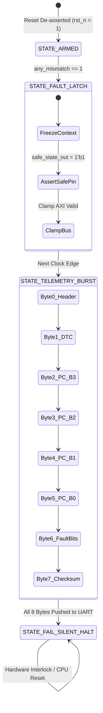

# Fault Control Unit (FCU) & Blackbox Telemetry Logging

> [!IMPORTANT] **Autonomous Hardware Telemetry Without Software Execution**
> When a fault strikes, the CPU core is corrupt. It is impossible to trust the CPU to execute an interrupt service routine (ISR) to log its own failure. The **Fault Control Unit (FCU)** is a dedicated hardwired finite state machine that freezes hardware diagnostic context and streams out crash packets directly to the UART FIFO **completely independent of CPU software**.

---

## 1. FCU State Machine Architecture



---

## 2. Hardwired Context Freeze Register Map

Upon the exact clock edge where `any_mismatch` asserts, the FCU captures the internal state into shadow registers:

| Register Name | Offset Address | Description | Captured Content |
| :--- | :--- | :--- | :--- |
| `FCU_STATUS_REG` | `0x1000_0020` | FCU Status & Lock | Bit [0]: `fault_active`<br>Bit [1]: `safe_state_pin`<br>Bits [7:4]: `fcu_state` |
| `FCU_PC_REG` | `0x1000_0024` | Faulting Program Counter | Exact `if_pc` address where core diverged (e.g., `0x0000_041C`) |
| `FCU_MISMATCH_REG` | `0x1000_0028` | Mismatch Bitmask Vector | Bit [0]: `addr_mismatch`<br>Bit [1]: `wdata_mismatch`<br>Bit [2]: `strb_mismatch`<br>Bit [3]: `ctrl_mismatch` |
| `FCU_CYCLE_REG` | `0x1000_002C` | 64-bit Timestamp | Microsecond hardware timer value at instant of failure |

---

## 3. Autonomous Blackbox Telemetry Frame Structure

The FCU streams an 8-byte diagnostic packet directly into the **16-word circular FIFO of the AXI4-Lite UART peripheral**:

```
 ┌──────────┬──────────┬──────────┬──────────┬──────────┬──────────┬──────────┬──────────┐
 │  Byte 0  │  Byte 1  │  Byte 2  │  Byte 3  │  Byte 4  │  Byte 5  │  Byte 6  │  Byte 7  │
 ├──────────┼──────────┼──────────┼──────────┼──────────┼──────────┼──────────┼──────────┤
 │  0xAA    │  0x46    │  PC[31:  │  PC[23:  │  PC[15:  │  PC[7:   │ Mismatch │ Checksum │
 │ (Header) │ ('F'=DTC)│   24]    │   16]    │    8]    │   0]     │ Vector   │  (XOR)   │
 └──────────┴──────────┴──────────┴──────────┴──────────┴──────────┴──────────┴──────────┘
```

### SystemVerilog Telemetry Push FSM:
```systemverilog
typedef enum logic [3:0] {
    ST_IDLE,
    ST_SEND_HDR,
    ST_SEND_DTC,
    ST_SEND_PC3,
    ST_SEND_PC2,
    ST_SEND_PC1,
    ST_SEND_PC0,
    ST_SEND_BITS,
    ST_SEND_CHKSUM,
    ST_HALT
} telem_state_t;

telem_state_t telem_state;

always_ff @(posedge clk or negedge rst_n) begin
    if (!rst_n) begin
        telem_state     <= ST_IDLE;
        uart_tx_push    <= 1'b0;
        uart_tx_byte    <= 8'h0;
        safe_state_out  <= 1'b0;
    end else begin
        case (telem_state)
            ST_IDLE: begin
                if (any_mismatch) begin
                    safe_state_out <= 1'b1; // Trigger external actuator interlock instantly
                    telem_state    <= ST_SEND_HDR;
                end
            end
            ST_SEND_HDR: begin
                uart_tx_byte <= 8'hAA; // Sync byte
                uart_tx_push <= 1'b1;
                telem_state  <= ST_SEND_DTC;
            end
            ST_SEND_DTC: begin
                uart_tx_byte <= 8'h46; // ASCII 'F' for Fault
                uart_tx_push <= 1'b1;
                telem_state  <= ST_SEND_PC3;
            end
            ST_SEND_PC3: begin
                uart_tx_byte <= captured_pc[31:24];
                uart_tx_push <= 1'b1;
                telem_state  <= ST_SEND_PC2;
            end
            ST_SEND_PC2: begin
                uart_tx_byte <= captured_pc[23:16];
                uart_tx_push <= 1'b1;
                telem_state  <= ST_SEND_PC1;
            end
            ST_SEND_PC1: begin
                uart_tx_byte <= captured_pc[15:8];
                uart_tx_push <= 1'b1;
                telem_state  <= ST_SEND_PC0;
            end
            ST_SEND_PC0: begin
                uart_tx_byte <= captured_pc[7:0];
                uart_tx_push <= 1'b1;
                telem_state  <= ST_SEND_BITS;
            end
            ST_SEND_BITS: begin
                uart_tx_byte <= {4'h0, captured_mismatch};
                uart_tx_push <= 1'b1;
                telem_state  <= ST_SEND_CHKSUM;
            end
            ST_SEND_CHKSUM: begin
                uart_tx_byte <= 8'hAA ^ 8'h46 ^ captured_pc[31:24] ^ captured_pc[23:16] ^
                                captured_pc[15:8] ^ captured_pc[7:0] ^ {4'h0, captured_mismatch};
                uart_tx_push <= 1'b1;
                telem_state  <= ST_HALT;
            end
            ST_HALT: begin
                uart_tx_push <= 1'b0; // Telemetry burst complete; remain fail-silent
            end
        endcase
    end
end
```

---

## 4. Hardware UART Peripheral Coupling

Because the UART peripheral features dual 16-word circular FIFOs, the FCU pushes all 8 bytes in **8 consecutive clock cycles ($80\text{ ns}$)** without ever waiting for the baud rate generator. The UART transmitter autonomously shifts the data out bit-by-bit over the physical `uart_txd` pin at 115200 baud to the vehicle flight data recorder.

Next: Review the overall memory map and system interconnect in [[01_Memory_Map_and_Interconnect_Architecture | System Interconnect & Memory Map Architecture]].
