# Comprehensive Phase-by-Phase Implementation Roadmap

> [!NOTE] **Methodical Execution Strategy**
> Each phase defines unambiguous inputs, engineering tasks, verification sign-offs, and tangible artifacts.

---

## Roadmap Overview

```mermaid
flowchart LR
    P1["Phase 1: Repo Setup & IP Linking"] --> P2["Phase 2: Dual-Core Stagger Pipeline"]
    P2 --> P3["Phase 3: DCLS Comparator & Firewall"]
    P3 --> P4["Phase 4: Crossbar & Telemetry Integration"]
    P4 --> P5["Phase 5: Bare-Metal C Firmware"]
    P5 --> P6["Phase 6: Fault Injection Testbench"]
    P6 --> P7["Phase 7: FPGA Synthesis & Timing"]
    P7 --> P8["Phase 8: Showcase & Documentation"]
```

---

## Phase 1: Repository Architecture & IP Linking
- **Goal**: Establish the project directory structure, vendor the existing validated IP repositories, and setup simulation scripts.
- **Tasks**:
  1. Initialize Git repository and standard folder hierarchy: `rtl/`, `tb/`, `sw/`, `synth/`, `docs/`.
  2. Vendor validated RV32I pipelined CPU core from `rv32i-axi-accelerator-uvm`.
  3. Vendor synthesizable AXI4-Lite UART and circular FIFO from `AXI4-Lite-UART-Peripheral-FIFO-Buffer`.
  4. Verify syntax compilation with Vivado `xvlog`.
- **Definition of Done (DoD)**: Zero syntax errors across all vendor modules in Vivado `xvlog`.

---

## Phase 2: Dual-Core Instantiation & Temporal Diversity Pipeline
- **Goal**: Implement the dual-core wrapper with 2-cycle staggered input/output pipelines.
- **RTL Module**: `rtl/dcls/dcls_core_wrapper.sv`.
- **Tasks**:
  1. Instantiate `core_master` and `core_shadow`.
  2. Implement 2-stage D-FF delay pipeline for instruction bus and data bus inputs into the shadow core.
  3. Implement 2-stage D-FF delay pipeline for bus outputs from the master core.
  4. Write testbench `tb/tb_dcls_wrapper.sv` verifying cycle-accurate phase tracking ($t$ vs $t-2$).
- **Definition of Done (DoD)**: Testbench confirms both cores execute identical code with a constant 2-cycle phase offset with zero divergence.

---

## Phase 3: DCLS Comparator & AXI Bus Firewall
- **Goal**: Implement the cycle-by-cycle comparison logic and zero-cycle write clamping firewall.
- **RTL Module**: `rtl/dcls/dcls_comparator_firewall.sv`.
- **Tasks**:
  1. Build bit-for-bit comparator across address, data, write strobe, and read/write control lines.
  2. Implement zero-cycle combinational gating (`AWVALID`, `WVALID`, `DMEM_WE`).
  3. Implement sticky hardware fault latch (`fault_latched`).
  4. Generate external hardware signal `safe_state_out = 1'b1`.
- **Definition of Done (DoD)**: Sub-nanosecond combinational clamp verified in simulation; zero illegal writes escape.

---

## Phase 4: System Crossbar & UART Telemetry Integration
- **Goal**: Integrate the memory crossbar, memory controllers, custom accelerator, and the AXI4-Lite UART peripheral.
- **RTL Module**: `rtl/safety_soc_top.sv`.
- **Tasks**:
  1. Expand AXI4-Lite Crossbar to 4 slaves (Instruction RAM, Data RAM, UART/FCU, Accelerator).
  2. Integrate Fault Control Unit (FCU) state machine.
  3. Route FCU autonomous telemetry byte-stream directly to UART TX FIFO.
  4. Expose `uart_txd` serial pin and `safe_state_out` pin at top level.
- **Definition of Done (DoD)**: Hardware fault autonomously triggers UART serial packet transmission without CPU intervention.

---

## Phase 5: Bare-Metal C Safety Firmware
- **Goal**: Write an embedded safety application demonstrating live operation and fault reporting.
- **Deliverables (`sw/`)**:
  1. `boot.S`: Startup assembly code initializing stack pointer and trap vectors.
  2. `uart.h` / `uart.c`: Low-level driver for the AXI4-Lite UART peripheral.
  3. `safety_ctrl.c`: Actuator control algorithm (simulated Anti-lock Braking System / ABS control loop).
  4. `syscalls.c`: Redirects standard C library `printf` to UART hardware.
- **Definition of Done (DoD)**: CPU runs ABS firmware, computes slip ratio, and streams telemetry at 115200 baud.

---

## Phase 6: SystemVerilog & UVM Fault Injection Verification Suite
- **Goal**: Build an industry-standard fault-injection testbench proving ISO 26262 ASIL-D compliance.
- **Deliverables (`tb/`)**:
  1. `tb_fault_injector.sv`: Automated bit-flip injection targeting PC, Regfile, and ALU.
  2. SVA Assertions: Latency $\le 2$ cycles, Zero firewall breaches, Telemetry packet correctness.
  3. Automated simulation regression script.
- **Definition of Done (DoD)**: 100% SPFM metric achieved across 500+ randomized fault injections.

---

## Phase 7: FPGA Synthesis & Static Timing Analysis
- **Goal**: Achieve physical timing closure on AMD Artix-7 (`xc7a35tcsg324-1`) using AMD Vivado.
- **Deliverables (`synth/`)**:
  1. `synth.tcl`: Automated Vivado batch mode synthesis and implementation script.
  2. `timing_constraints.xdc`: 100 MHz clock and I/O delay constraints.
- **Definition of Done (DoD)**: Worst Negative Slack (WNS) $> 0.000\text{ ns}$ at 100 MHz, 0 inferred latches.

---

## Phase 8: Documentation, Obsidian Knowledge Base & GitHub Showcase
- **Goal**: Package the repository for maximum recruiter and hiring manager impact.
- **Deliverables**:
  1. Comprehensive README.md with visual Mermaid diagrams, architecture flowcharts, and timing waveforms.
  2. Fully interlinked Obsidian knowledge base vault in `Safety Critical Dcls Soc/`.
  3. Recorded simulation transcripts and waveform captures.
- **Definition of Done (DoD)**: Turnkey, publication-ready repository ready for GitHub showcasing.
